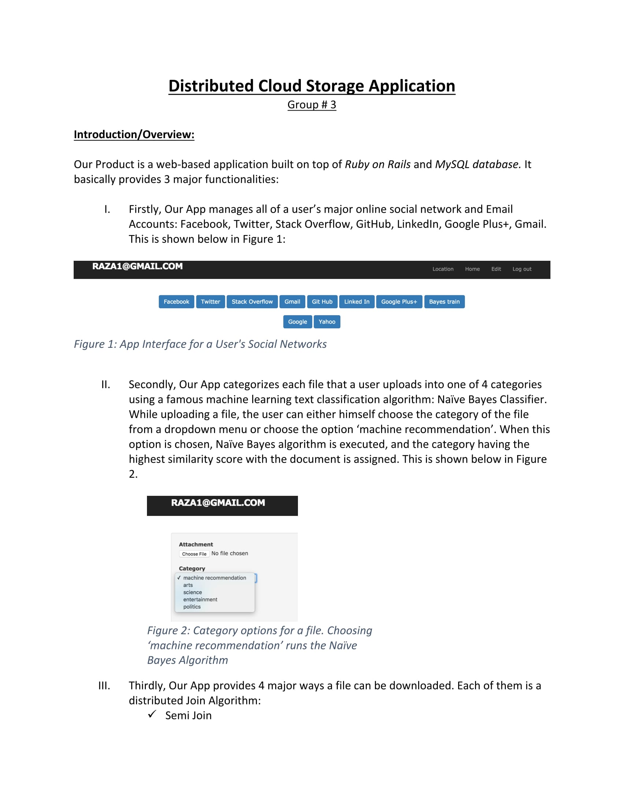
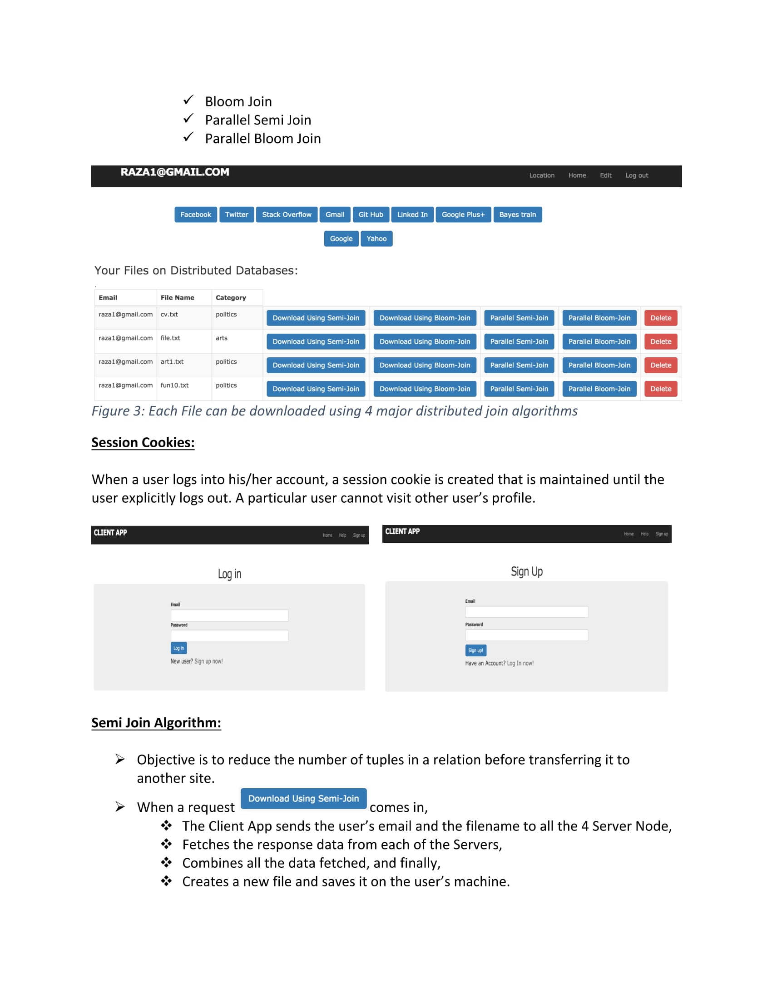
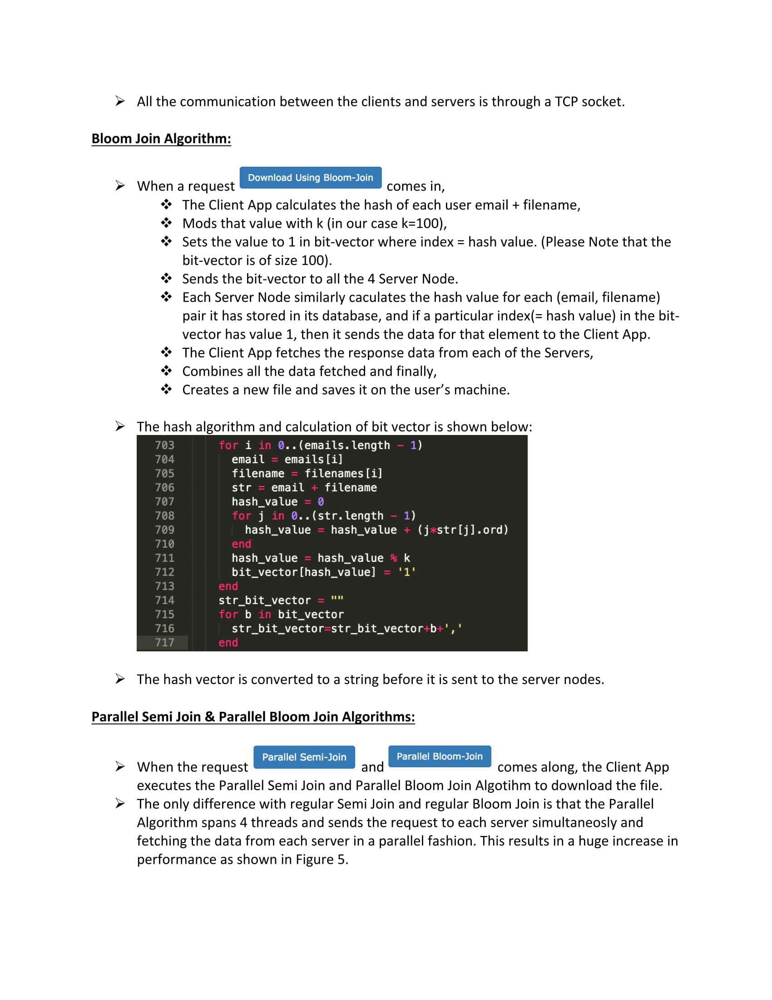
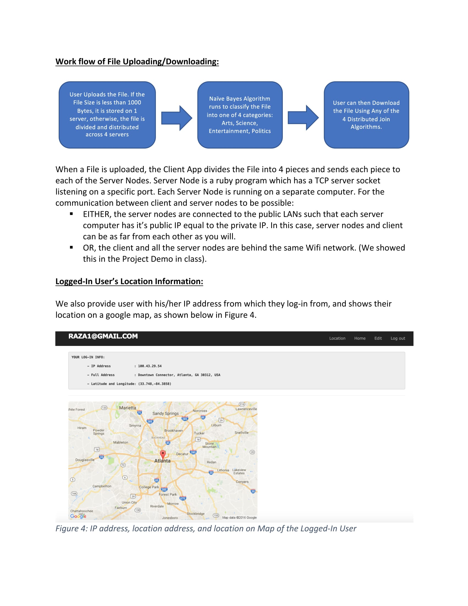
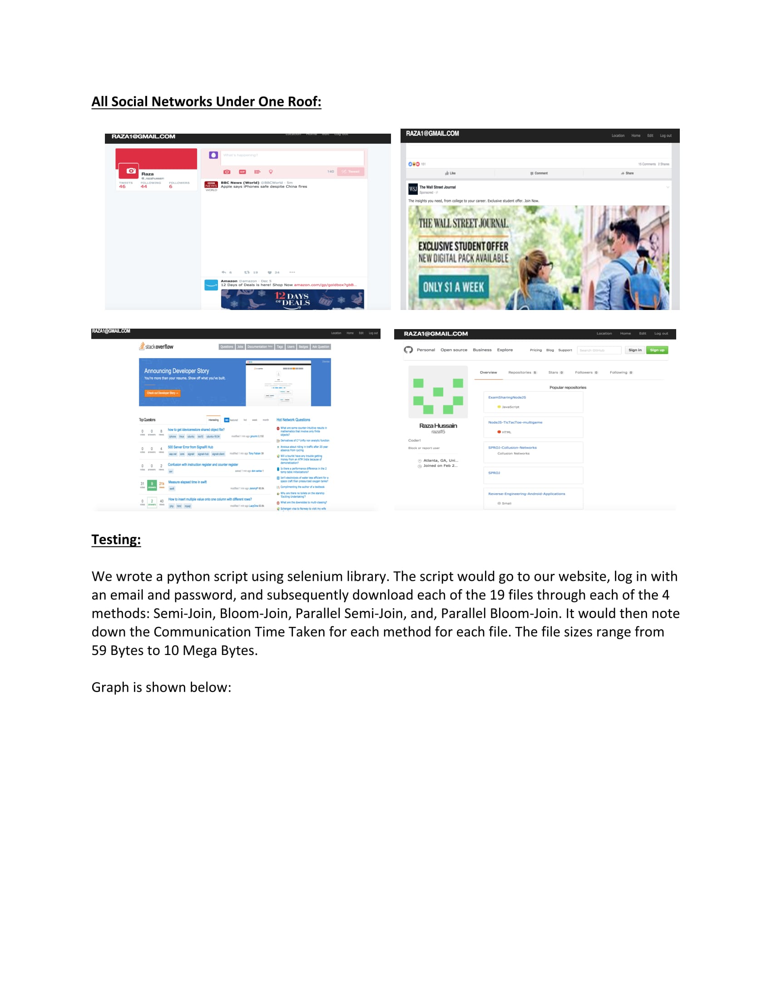
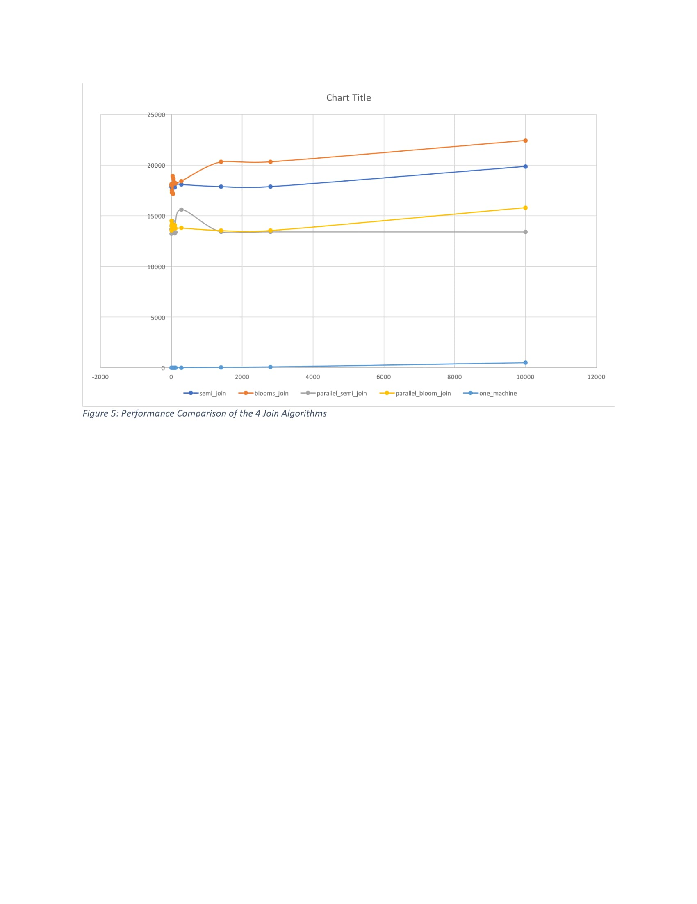

# "Distributed File Storage System" AND "Document Classifier" AND "Social Network Manager"

Run the Project by going into Client directory and typing:
```
$ rails server
```
And then go to http://localhost:3000.

To run the server on a particular computer:
```
$ ruby server1.rb
```
```
$ ruby server2.rb
```
```
$ ruby server3.rb
```
```
$ ruby server4.rb
```

Edit the file “server_adds.txt” in the Client folder. 1st line in the file should contain the private IP address of the machine on which server1.rb is running, 2nd line in the file should contain the private IP address of the machine on which server2.rb is running, etc.


# Project Report 






